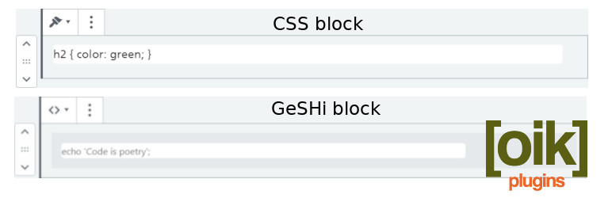

# oik-css 

* Contributors: bobbingwide, vsgloik
* Donate link: https://www.oik-plugins.com/oik/oik-donate/
* Tags: CSS, GeSHi, blocks, shortcodes, [bw_css], [bw_geshi], [bw_autop], [bw_background], oik, lazy, smart
* Requires at least: 5.0
* Tested up to: 6.1.1
* Gutenberg compatible: Yes
* Stable tag: 2.1.0
* License: GPLv2 or later
* License URI: http://www.gnu.org/licenses/gpl-2.0.html

## Description 
Allows internal CSS styling to be included in the content of the page.

- Use the CSS block to add custom CSS.
* - Use the GeSHi block to syntax highlight: CSS, HTML, JavaScript, jQuery, PHP, MySQL or None.

For backward compatibility:

- Use the [bw_css] shortcode to add custom CSS as and when you need it.

For designers, developers and documenters [bw_css] supports echoing of the custom CSS, allowing you to document the CSS you are using.
For readability, the CSS is processed using the Generic Syntax Highlighter (GeSHi) processing.

* - Use the [bw_geshi] shortcode for syntax highlighting of: CSS, HTML(5), JavaScript and jQuery, PHP and MySQL.
* Also supports language: none.

If the oik base plugin is activated

- Use the [bw_autop] shortcode to disable or re-enable WordPress's wpautop() logic.

- Use the experimental [bw_background] shortcode to display an attached image in the background.


## Installation 
1. Upload the contents of the oik-css plugin to the `/wp-content/plugins/oik-css' directory
1. Activate the oik-css plugin through the 'Plugins' menu in WordPress
1. Use the CSS and GeSHi blocks within your content.

## Frequently Asked Questions 

# What are the dependencies? 

This code is no longer dependent upon the oik base plugin; it uses shared libraries.
If you want to use the shortcodes then using oik v3.3.7 or higher is still recommended.

# What is the syntax? 
```
[bw_css] your CSS goes here [/bw_css]
```

* Note: The ending shortcode tag [/bw_css] is required

# How do I get the GeSHi output? 
Either
```
[bw_css .] your CSS goes here[/bw_css]
```

or
```
[bw_css text="Annotation to the CSS that will follow"] your CSS goes here[/bw_css]
```

# How do I get GeSHi output for other languages? 

Use the [bw_geshi] shortcode.
e.g.
[bw_geshi html]&lt;h3&gt;[bw_css], [bw_geshi] &amp; [bw_background]&lt;/h3&gt;&lt;p&gt;Cool, lazy smart shortcodes from oik-plugins.&lt;/p&gt;
[/bw_geshi]

Supported languages are:

* CSS
* HTML(5)
* JavaScript and jQuery
* PHP
* MySQL
* none

If you want to display syntax highlighted CSS without affecting the current display use [bw_geshi css].


# What version of GeSHi does oik-css use? 
oik-css delivers a subset of GeSHi version 1.0.9.0, which was released in May 2017, with modifications to support PHP 7.2

Only a small selection of the languages are supported by oik-css. These are the languages primarily used by WordPress.

* Note: oik-css will only load the GeSHi code if it is not already loaded.

# What about Gutenberg? 
oik-css has been tested with the Gutenberg plugin and some problems were detected.
For details see https://github.com/bobbingwide/oik-css/issues/9.
Changes have been made to undo the unwanted wpautop processing that affected the output of the bw_geshi shortcode.

In the future you may want to convert your shortcodes to blocks.
We are developing a new plugin for this... https://github.com/bobbingwide/oik-block.
This new plugin depends on Gutenberg, the oik base plugin and oik-css.


## Screenshots 
1. CSS block example
2. GeSHi block example
3. [bw_css] - syntax and examples
4. [bw_geshi] - examples
5. oik-CSS options - available when oik is active


## Upgrade Notice 
# 2.1.0 
Update for ability to style CSS and GeSHi output in documentation

## Changelog 
# 2.1.0 
* Changed: Implement get_block_wrapper_attributes #16
* Changed: Adding styling of text,background and font size #16
* Changed: Updated wp-scripts
* Tested: With WordPress 6.1.1 and WordPress Multi Site
* Tested: With PHP 8.0
* Tested: With Gutenberg 14.5.4

## Further reading 
If you want to read more about the oik plugins then please visit the
[oik plugin](https://www.oik-plugins.com/oik)
**"OIK - OIK Information Kit"**
